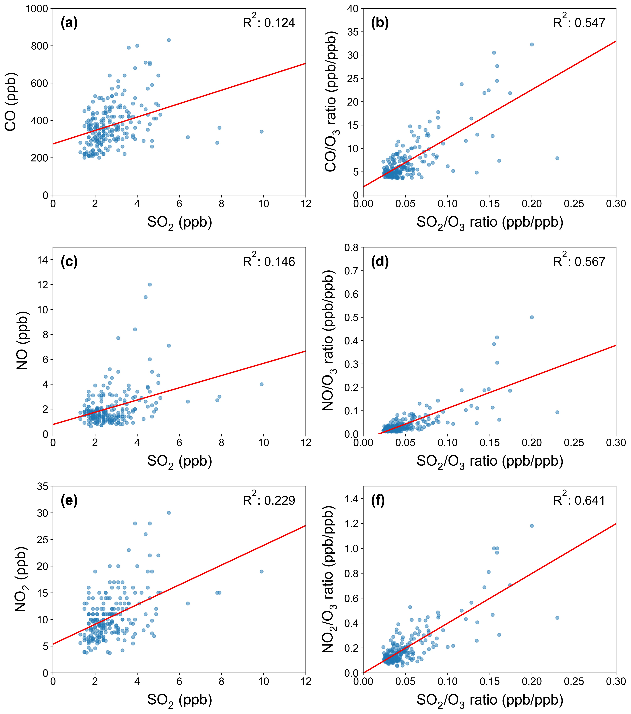
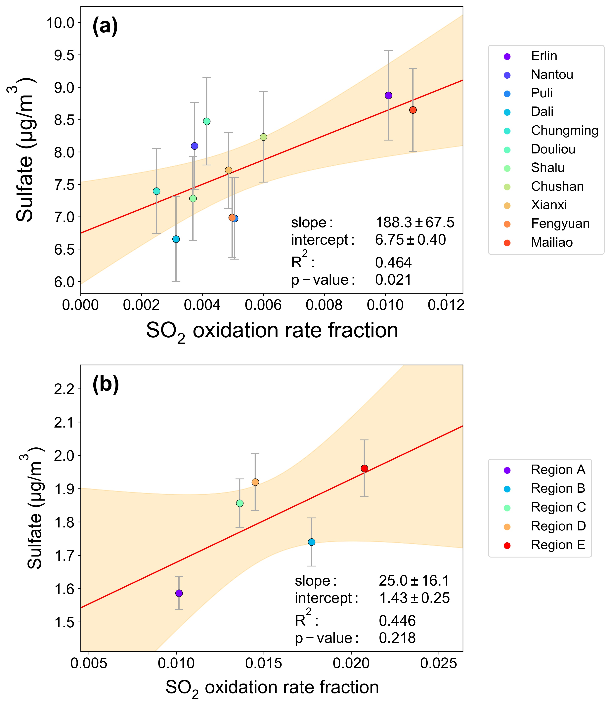
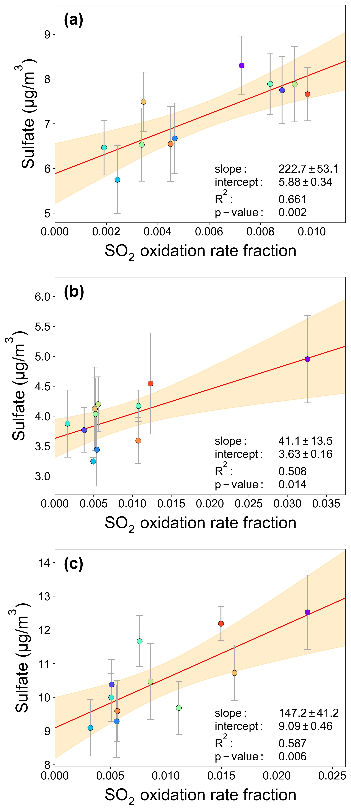
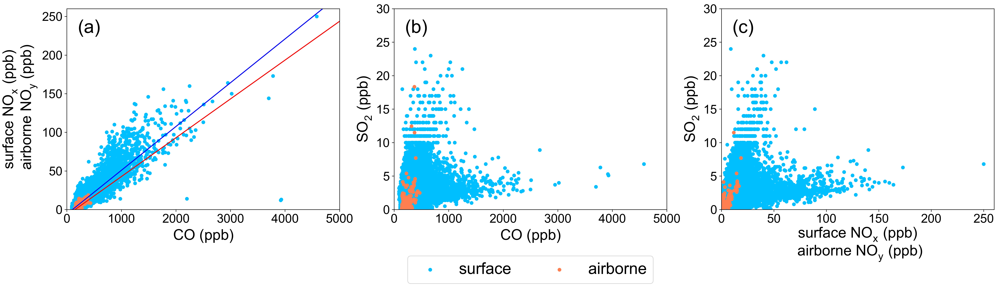
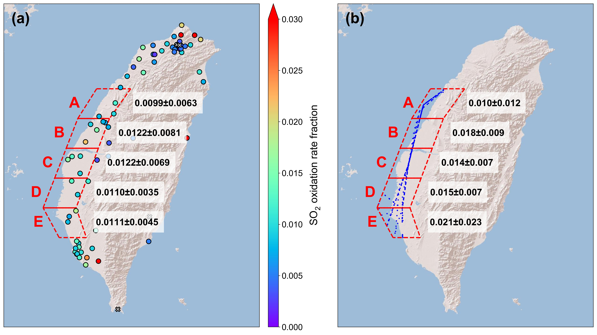
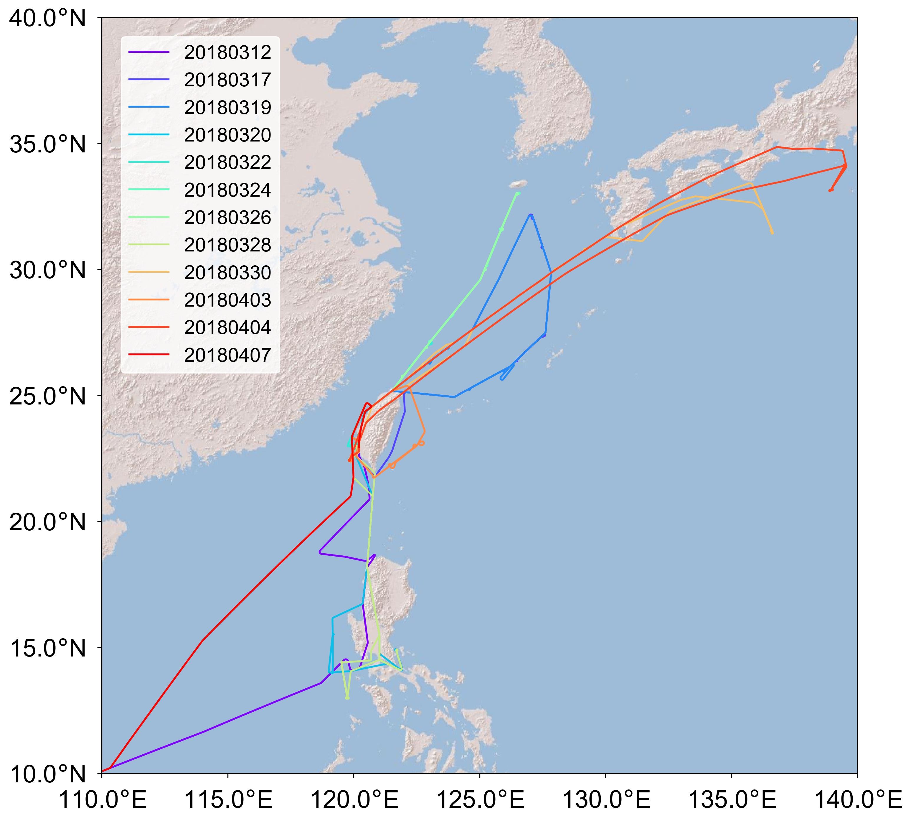
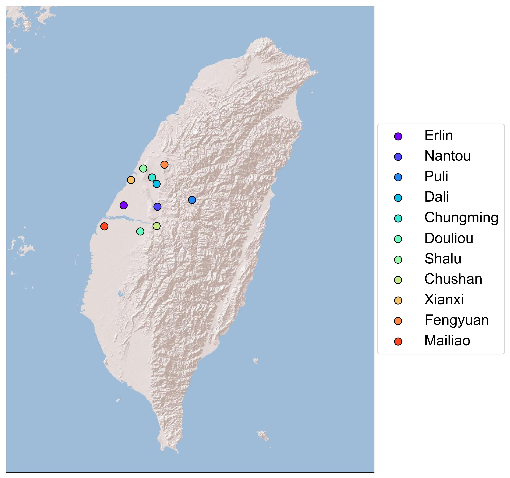
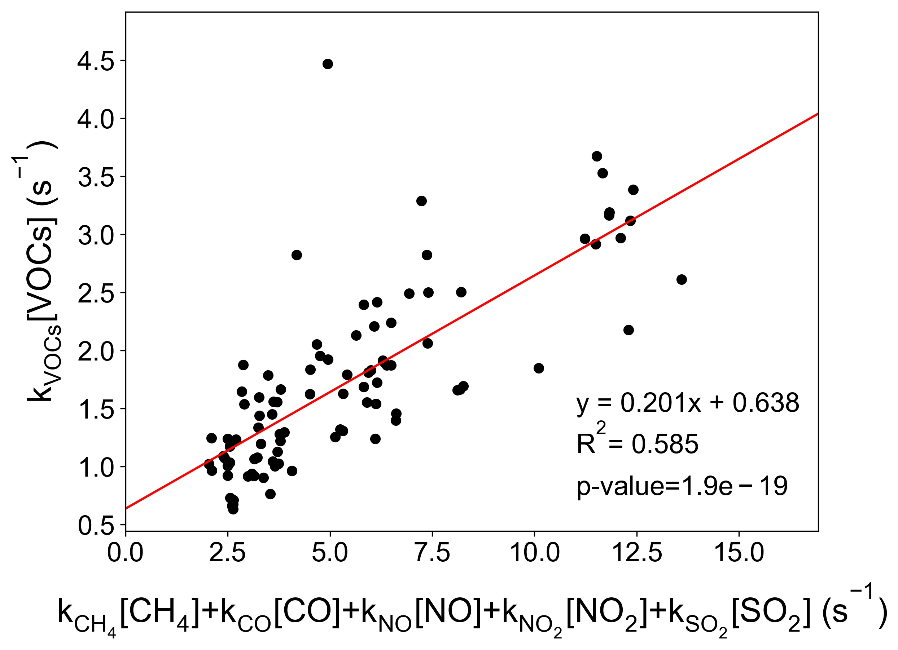
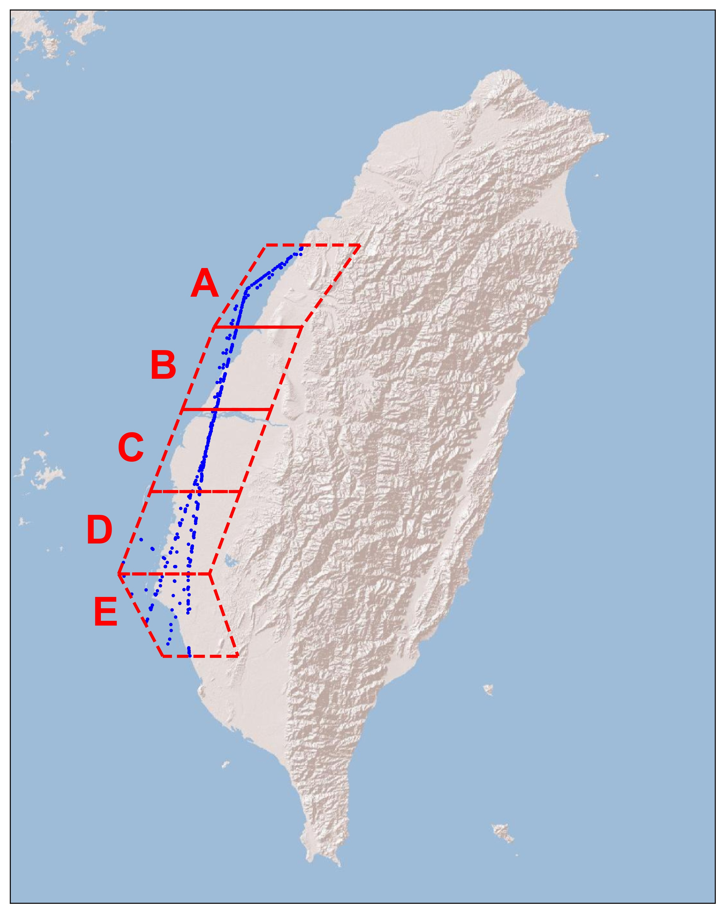
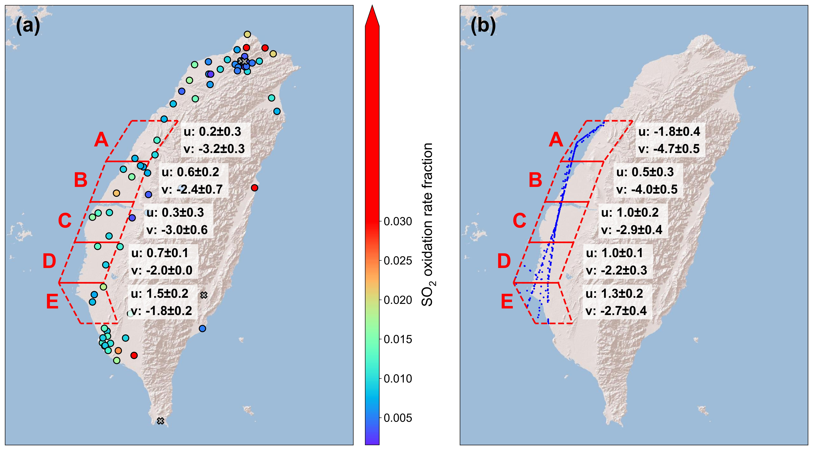

# Information

This file briefly describes the data analysis procedure in the paper "Contribution of SO2-OH Gas-phase Reaction to Total Sulfate Aerosols over West Pacific". If you have any questions, welcome to contact the author (yuwenchen@gate.sinica.edu.tw).

# Download EMeRGe-Asia measurments

1. Full mission name: Effect of megacities on the transport and transformation of pollutants on the regional and global scale - Asia
2. Dataset website: https://halo-db.pa.op.dlr.de/mission/97 (Must sign in to download data.) SSome files' names have been changed by ourselves. 

<br />

The data we downloaded includes: 
* location and meteorological/adlr data 
* PAN data 
* CH4&CO2 data 
* VOCs 
* aerosol compositions/ORGNO3SO4NH4CHL  
* NO&NOy data
* SO2 data
* CO data
* O3 data from AMTEX & FAIROCI
* NO2 data from MINIDOAS


# Convert ames files to csv and txt files


1. create and activate a python2.7 environment (named as 'ames' for example)


```python
conda create -n ames python=2.7
conda activate ames
pip install numpy
pip install NAStools
```

2. convert ames files to csv and txt files


```python
python2 file01_ames2csv_and_txt.py > ames_preprocess.log
```

# Process adlr related nc files


```python
python2 file02_nc_change_name_and_ncdump.py > adlr_preprocess.log
```

# Get time, location, and meteorological conditions from adlr nc files

1. create and activate a new python3 environment (named as 'emerge-asia' for example)


```python
conda create -n emerge-asia python=3
conda activate emerge-asia
pip install numpy pandas matplotlib netCDF4 uncertainties
```

2. Get location and time data from adlr files


```python
python3 file03_time_location_collection.py > time_location_collection.log
```

# Prepare 1min-average data over Western Taiwan and 15s-average data in all area


```python
python3 file04_Western_Taiwan_dataset-1min.py > Western_Taiwan_dataset.log
python3 file05_All_area_dataset-15s.py > All_area_dataset.log
```

# Analyze the data and plot

* EPA dataset (Taiwan_EPA_observation.csv) is download from Taiwan EPA's website (https://airtw.epa.gov.tw/CHT/Query/His_Data.aspx) with our rearrangement.
* PM2.5 observation data (PM25_sinica_11cities.csv) are obtained from Dr. Charles C.-K. Chou's Lab.


```python
python3 file06_analysis_and_plot.py
```

    
        Plot Figure 2: The CO-SO2 (a, b), NO-SO2 (c, d), and NO2-SO2 (e, f) relationships 
        before (a, c, e) and after (b, d, f) the O3 normalization of Tainan station.
        





    
        Figure 3: Relationships between sulfate concentrations and SO2 oxidation rate fraction
        of surface EPA stations during March 13th to 31st, 2018 (a) and airborne observation
        from March 17th to April 7th, 2018 (b). Fitting lines are plotted in solid red lines
        with orange shades of 95% confidential interval.
        





    
        Figure 4: The relationships between sulfate concentration and SO2 oxidation rate fraction
        using equation 9 based on surface measurements. The durations of (a), (b), and (c) are
        March 13rd – 19th, Mach 21st - 23rd, and Mach 25th – 28th, respectively.
        





    
        Plot Figure 5: The flight trail of data (left) utilized to calculate the correlation of
        sulfate and SO2 oxidation rate fraction (right). The altitudes of the flights are
        (a, b) 300 m, (c, d) 300 m, (e, f) 500 m, (g, h) 700 m, (i, j) 900 m, and (k, l) 1200 m, respectively. 
        


    
        Plot Figure 6: The relationships of (a) NOx to CO at the surface and NOy to CO in the air,
        (b) SO2 to CO, and (c) SO2 to NOx at the surface and SO2 to NOy in the air. 
        





    
        Plot Figure 7: Correlation coefficients (R2) before and after the O3 normalization of
        CO-SO2 (a), NO-SO2 (a), and NO2-SO2 (a) of EPA stations over Western Taiwan
        illustrated in the left and right side of circles, respectively. 
        





    
        Plot Figure S1: Flight tracks of EMeRGe-Asia campaign over West Pacific.
        





    
        Plot Figure S2: The geographic locations of the 11 sampling sites the averaged composition of PM2.5.
        





    
        Plot Figure S3: elationship between VOCs-OH radical reaction rates and the summation of
        other trace gases (CH4, CO, NO, NO2, and SO2)-OH reaction rates. Reaction rate constant “k” of
        each trace gas is the second-order or pseudo-second-order reaction rate constant (kA[A][OH],
        which A represents trace gases we study in this research) at 298K. VOCs include formaldehyde, methanol,
        acetonitrile, acetaldehydem acetone, isoprene, benzene, toluene, and xylene.
        





    
        Plot Figure S4: Correlation coefficients (R2) before and after the O3 normalization of
        CO-SO2 (a), NO-SO2 (a), and NO2-SO2 (a) of EPA stations over Western Taiwan
        illustrated in the left and right side of circles, respectively. 
        


    
        Plot Figure S5: Five self-defined regions over Western Taiwan with the flight tracks in these regions.
        





    
        Plot Figure S6: The average wind speed of each region at the surface (a) and in the air (b). 
        





